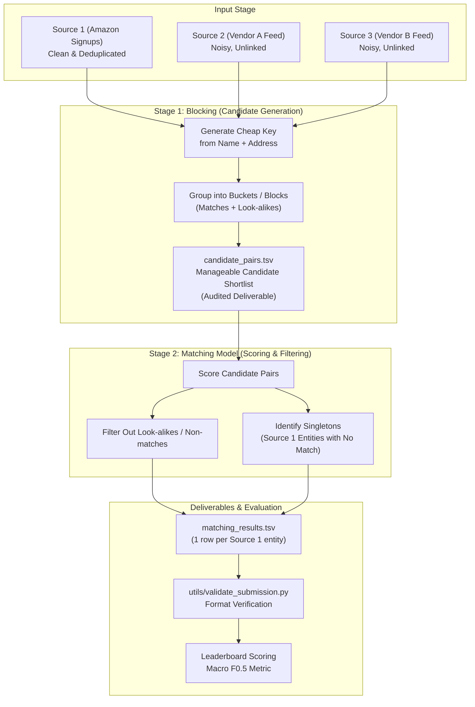

# Amazon ML Hackathon — Problem Statement

## 1. Problem Statement

The **Amazon ML Challenge 2026** focuses on **Business Entity Resolution**. 

Participants are tasked with determining which business records arriving from three independent sources—sharing no common identifier or foreign key—refer to the same underlying real-world business entity.

The challenge models a real-world enterprise scenario where a business account is registered on Amazon Business, and external vendor feeds are integrated to enrich the account's profile. Because each source uses distinct formatting, abbreviations, naming conventions, and noise levels, the machine learning system must accurately link records based solely on two textual attributes: **business name** and **business address**.

---

## 2. Problem Background

When a commercial entity registers on **Amazon Business**, core identifying information is collected at sign-up, primarily:
* **Business Name** (e.g., *Acme Robotics Inc.*)
* **Business Address** (e.g., *500 Market St, San Jose, CA*)

To build a richer, more comprehensive profile of the business, Amazon ingests supplementary data from external data vendors/providers. In practice:
1. Each external data feed originates from a distinct data vendor with proprietary formatting styles, regional naming conventions, and abbreviations.
2. External records share **no common primary or foreign key** (no shared ID) with Amazon's internal reference data or with each other.
3. Although other attributes like phone number and email address may exist in real-world environments, this challenge explicitly isolates and limits the matching data strictly to **name** and **address**.

As a result, identifying whether an incoming vendor record describes an already-registered business requires non-trivial text and entity matching under real-world noise.

---

## 3. Core Problem

Given three datasets:
* **Source 1**: Reference, deduplicated Amazon Business sign-up records.
* **Source 2**: Records from external Data Vendor A.
* **Source 3**: Records from external Data Vendor B.

The core objective is:
> **For every entity in Source 1, identify all corresponding matching records across Source 2 and Source 3.**

Key operational realities of the core problem:
* A Source 1 entity may link to **many** records across Source 2 and Source 3.
* A Source 1 entity may link to **exactly one** record.
* A Source 1 entity may link to **zero** records (known as a **singleton**).
* Matching must be conducted without any external lookups, geocoders, or shared unique identifiers.

---

## 4. Why This Problem Matters

1. **Foundational Data Integration Challenge**: Business entity resolution is a universal, critical challenge in data warehousing, customer master data management (MDM), supply chain visibility, and enterprise fraud detection.
2. **Profile Enrichment**: Accurate entity linking enables Amazon Business to consolidate siloed information from third parties, ensuring businesses receive appropriate credit, compliance checks, catalog recommendations, and services.
3. **High Cost of False Merges**: Inadvertently merging two distinct businesses (a false merge) corrupts account integrity, conflates credit/tax histories, and breaches data privacy. The problem statement explicitly establishes that false merges are penalised roughly twice as heavily as missed matches.
4. **Computational Scalability**: Performing exhaustive pairwise comparisons ($O(N^2)$ Cartesian product) across millions of potential record combinations from three separate sources is computationally impossible at scale. Developing efficient candidate pruning (blocking) paired with precise discriminative matching is essential.

---

## 5. Target Users / Stakeholders

Based strictly on the problem statement video:
* **Amazon Business**: The enterprise platform managing business customer sign-ups and requiring deduplicated, enriched entity profiles.
* **Business Customers / Sign-ups**: Real-world commercial entities (e.g., *Acme Robotics Inc.*) registering for Amazon Business accounts whose profiles must be accurately maintained without conflation.
* **External Data Vendors / Providers**: Third-party commercial data vendors (Vendor A / Source 2 and Vendor B / Source 3) supplying supplementary business information.
* **Hackathon Participants / ML Engineers**: Teams tasked with designing, training, validating, and submitting the entity resolution and blocking pipeline.
* **Hackathon Judges / Organizers**: Amazon ML Challenge evaluators reviewing leaderboard performance, auditing blocking candidate sets, and inspecting runnable code and methodology documentation.

---

## 6. Input

The input data provided to the ML system consists of tabular records across three distinct sources:

### Input Sources & Characteristics
1. **Source 1 (Reference)**:
   * **Role**: Primary reference dataset; clean and internally deduplicated.
   * **Origin**: Amazon Business account registration.
   * **Fields**: Record ID, Business Name, Business Address.
2. **Source 2 (Vendor A)**:
   * **Role**: Noisy external dataset to be reconciled against Source 1.
   * **Origin**: Data Vendor A format and conventions.
   * **Fields**: Record ID, Business Name, Business Address.
3. **Source 3 (Vendor B)**:
   * **Role**: Noisy external dataset to be reconciled against Source 1.
   * **Origin**: Data Vendor B format and conventions.
   * **Fields**: Record ID, Business Name, Business Address.

### Input Format & File Specifications
* **File Type**: Tab-separated values (`.tsv`).
* **Delimiter**: Explicit tab character (`sep='\t'`).
* **Attributes Present**:
  * Record identifier (e.g., `S1-732914`, `S2-118820`, `S3-065477` / `S3-905477`).
  * Business Name (e.g., *Acme Robotics Inc.* vs. *Acme Robotics Incorporated* vs. *Acme Robotics*).
  * Business Address (e.g., *500 Market St, San Jose* vs. *500 Market Street, San Jose CA* vs. *Nr. City Hall, San Jose*).
* **Attributes Deliberately Excluded**:
  * Phone number and email address are explicitly excluded for this competition.

### Input Variations & Challenges
* **Lexical Variations**: Inconsistent abbreviations (e.g., *Inc.* vs. *Incorporated*, *St* vs. *Street*).
* **Spatial / Landmark References**: Addresses referencing nearby landmarks (e.g., *Nr. City Hall, San Jose*) rather than standard postal addresses.
* **Region-Specific Patterns**: Distinct regional conventions in both company naming and geographic address syntax.
* **Look-alikes**:
  * Unrelated businesses with similar names at different locations (e.g., *Acme Bakery LLC* at 508 Market St).
  * Unrelated businesses sharing the same address/building.

---

## 7. Expected Output

The system must produce predictions mapping each Source 1 entity to its corresponding matching record IDs from Source 2 and Source 3.

### Primary Prediction File (`matching_results.tsv`)
* **Format**: Tab-separated values (`.tsv`), one row per Source 1 entity.
* **Row Structure**:
  ```tsv
  <source_1_id>	<source_2_or_3_id_1>,<source_2_or_3_id_2>,...
  ```
  *(The Source 1 ID and the match list are separated by a tab `\t`; the matches are comma-separated `,*)*
* **Singleton Representation**:
  * If a Source 1 entity has no matching record in Source 2 or Source 3, the match list must be empty (i.e., the row contains only the Source 1 ID followed by a tab and an empty string).
* **Role**: This is the **only file scored on the leaderboard**.

### Intermediate Blocking File (`candidate_pairs.tsv`)
* **Format**: Tab-separated candidate pairs generated during the blocking stage.
* **Role**: Captures the candidate search space produced prior to model filtering. Submitted in the final package and **audited by organizers** to assess blocking quality and recall coverage.

---

## 8. Requirements

* [ ] Reconcile records across all three independent data sources (Source 1, Source 2, Source 3).
* [ ] Base all matching decisions strictly on the provided `name` and `address` fields.
* [ ] Generate predictions for **every single Source 1 entity** present in the test set.
* [ ] Handle singletons correctly by predicting an empty match list for Source 1 entities with no matches in Source 2 or Source 3.
* [ ] Format all submissions as tab-separated (`.tsv`) files using explicit tab separation (`sep='\t'`).
* [ ] Ensure the submission passes the official format validator (`utils/validate_submission.py`) prior to upload.
* [ ] Upload `matching_results.tsv` during the competition to obtain a score on the leaderboard.
* [ ] Prepare and submit a complete final `.zip` package at challenge close containing:
  * [ ] `output/matching_results.tsv` (final matches)
  * [ ] `output/candidate_pairs.tsv` (blocking candidate set for auditing)
  * [ ] `code/...` (runnable end-to-end pipeline)
  * [ ] `Documentation_template.md` (completed methodology document)
* [ ] Strictly adhere to the no-external-lookup rule.

---

## 9. Constraints and Limitations

1. **Strict Prohibition on External Data**:
   > **No external data lookup.** External databases, public/private APIs, and external geocoding services are **strictly prohibited**. Models must rely entirely on the provided dataset.
2. **Absence of Shared Identifiers**:
   * No universal business registration IDs, tax IDs, or cross-source keys exist.
3. **Restricted Feature Space**:
   * Only `name` and `address` are supplied. High-signal disambiguation features such as phone number, domain name, email address, and tax registration number are withheld.
4. **Data Delimitation Constraint**:
   * All files must be read and written strictly as tab-delimited files (`sep='\t'`). Comma delimiters will cause parsing failure due to commas present in address and name fields.
5. **Asymmetric Error Penalization**:
   * Precision is prioritized over recall. A false merge is penalized roughly twice as heavily as a missed match.
7. **Official Candidate Generation Ranking Mandate**:
   * The organizers explicitly announced: *"The approach that generates a smaller candidate set per Source 1 entity will be ranked higher in the final evaluation beyond the public/private leaderboard."* Candidate generation efficiency is audited as an explicit tie-breaker and ranking factor.
8. **Model License & Architecture Constraint**:
   * Final models must use an **MIT or Apache 2.0 license** and be **up to 8 Billion parameters**.

---

## 10. Dataset / Data Information

### Training Set
* **Contents**: Business records across all 3 sources (Source 1, Source 2, Source 3).
* **Ground Truth File**: `train_ground_truth.tsv`
* **Ground Truth Format**:
  * One row per Source 1 entity.
  * Schema: `<source_1_id>\t<comma-separated list of matching Source 2 and Source 3 ids>`
  * Singletons hold an empty list after the tab separator.
* **Purpose**: Used by participants to build, train, tune, and evaluate their blocking and matching models.

### Test Set
* **Contents**: Business records across the same 3 sources (Source 1, Source 2, Source 3).
* **Labels**: Unlabeled (no ground-truth provided).
* **Purpose**: Used to generate final predictions scored on the competitive leaderboard.

### Data Volume & Specifications (Verified from Official Resources)
* **Schema Columns**:
  * `entity_id`: Unique identifier (`S1-`, `S2-`, or `S3-` prefix indicating origin).
  * `business_name`: Trading/legal business name.
  * `business_address`: Full physical/landmark address.
  * `country`: Country label (`US`, `India`, and in test set `France`).
* **Training Set Volume**:
  * `train_source1.tsv`: **2,206,821** records (US: 1,323,633; India: 883,188).
  * `train_source2.tsv`: **5,034,616** records (US: 3,016,817; India: 2,017,799).
  * `train_source3.tsv`: **5,285,603** records (US: 3,170,056; India: 2,115,547).
  * `train_ground_truth.tsv`: **2,206,821** rows mapping S1 to matches (**7,638,365** true match pairs).
  * *Singletons*: **123,247** records (**5.58%** of S1).
  * *Matched Entities*: **2,083,574** records (**94.42%** of S1; average 3.666 matches).
  * *Cross-Country Matches*: **0 (0.0000%)** — Country separation is 100% loss-free.
* **Test Set Volume**:
  * `test_source1.tsv`: **1,732,544** records (India: 809,986; US: 663,106; France: 259,452).
  * `test_source2.tsv`: **4,887,273** records (India: 2,312,565; US: 1,871,330; France: 703,378).
  * `test_source3.tsv`: **5,082,316** records (India: 2,405,000; US: 1,945,701; France: 731,615).
  * **Critical Out-of-Distribution Factor**: `France` appears in the test set but **does not exist in the training set**. Pipelines must treat country as an open string and generalize to French address syntax.
* **Total Volume**: **24,229,173 records** across training and test sources (~26.4 million lines including ground truth).

---

## 11. Evaluation Criteria

### Official Competition Metric: Macro $F_{0.5}$

Submissions are evaluated using the **macro-averaged $F_{0.5}$ score**, a precision-weighted metric that places twice as much importance on precision as on recall.

$$\beta = 0.5 \implies \beta^2 = 0.25$$

$$F_{0.5} = \frac{(1 + 0.5^2) \times \text{Precision} \times \text{Recall}}{0.5^2 \times \text{Precision} + \text{Recall}} = \frac{1.25 \times \text{Precision} \times \text{Recall}}{0.25 \times \text{Precision} + \text{Recall}}$$

### Practical Implications of $F_{0.5}$
* **Precision Weighting**: False positives (false merges) are penalized roughly **twice as severely** as false negatives (misses).
* **Guiding Heuristic**: *"When unsure, do not merge."*

### Singleton Evaluation Rule
* A **singleton** is a Source 1 entity with zero true matches in Source 2 or Source 3.
* **Correct prediction (empty list)**: Yields a full score of **1.0** for that entity.
* **Incorrect prediction (predicting any match)**: Yields a score of **0.0** for that entity.
* Correct singleton identification is therefore just as impactful to the overall score as finding true positive matches.

### Audit & Verification Process
* The leaderboard score is derived from `matching_results.tsv`.
* Top-ranking teams undergo an audit of their final `.zip` package:
  * Verification of blocking quality via `candidate_pairs.tsv`.
  * Execution and inspection of the pipeline via `code/`.
  * Review of methodology and modeling justification via `Documentation_template.md`.
* Final rankings are confirmed only after successful audit completion.

---

## 12. Expected Deliverables

### 1. During the Challenge (Leaderboard Submissions)
* **File**: `matching_results.tsv`
* **Format**: Tab-separated file containing one row per Source 1 entity with its comma-separated matching IDs (empty list if singleton).
* **Validation**: Must pass `utils/validate_submission.py` before submission to avoid wasted attempts from formatting errors.

### 2. At Challenge Close (Final Package Submission)
A single compressed `.zip` archive containing:
1. `output/matching_results.tsv`: Final predicted matches evaluated on the leaderboard.
2. `output/candidate_pairs.tsv`: Output of the blocking stage (candidate pairs considered), used by organizers to audit blocking quality.
3. `code/`: Complete, runnable end-to-end pipeline code.
4. `Documentation_template.md`: Completed technical methodology document explaining the design, algorithms, blocking rules, and evaluation results.

---

## 13. Important Terminology

| Term | Definition as Provided in the Problem Statement |
| :--- | :--- |
| **Business Entity Resolution** | The machine learning task of determining which records from multiple disparate, unlinked sources refer to the same real-world business entity. |
| **Source 1 (Reference)** | The clean, deduplicated baseline dataset representing businesses signed up on Amazon Business. |
| **Source 2 & Source 3 (Vendors)** | Noisy external data feeds provided by third-party data vendors, lacking common identifiers. |
| **Blocking** | An initial candidate-generation phase that groups records into buckets using a computationally cheap key built from name and address, pruning the comparison space from $O(N^2)$ to a manageable set of candidate pairs. |
| **Recall Ceiling** | The theoretical maximum recall achievable by the matching model, strictly bounded by the candidate pairs captured during the blocking stage. |
| **Candidate Pairs** | The shortlist of record pairs generated by the blocking stage that are forwarded to the matching model for scoring. |
| **Look-alikes** | Records that share similar names but different addresses, or share the same address but belong to different businesses. Captured during blocking but filtered out by matching. |
| **Matching Model** | The predictive model that scores candidate pairs and discards non-matches to retain only true matches. |
| **Singleton** | A Source 1 entity that does not exist in either Source 2 or Source 3 (has zero matching records). |
| **False Merge** | Erroneously linking two records that represent distinct real-world businesses (false positive), penalized twice as heavily under $F_{0.5}$. |
| **Miss** | Failing to link two records that truly represent the same business (false negative). |
| **Macro $F_{0.5}$** | The competition evaluation metric: an $F$-measure weighting precision twice as heavily as recall, averaged across entities. |

---

## 14. Problem Workflow

The official problem statement outlines a two-stage machine learning system architecture:



### Distinction Between Organizer Specifications and Implementation
* **Explicitly Specified by Organizers**:
  * Two-stage architecture: (1) Blocking via cheap key from name and address to generate candidate pairs, followed by (2) Matching model to score candidates and filter out look-alikes.
  * Inputs are Source 1, 2, and 3 TSVs (`sep='\t'`).
  * Outputs are `candidate_pairs.tsv` and `matching_results.tsv`.
  * Submission validation via `utils/validate_submission.py`.
* **Left to Participant Implementation**:
  * Specific blocking key design, algorithms, hashing, or indexing mechanisms.
  * Specific matching model architecture, feature engineering, similarity functions, or classification models.
  * Specific decision thresholds used to trade off precision and recall.

---

## 15. Key Takeaways

1. **Core Objective**: Perform business entity resolution across three unlinked sources (one reference, two vendor feeds) relying exclusively on business names and addresses.
2. **Two-Stage Architecture Mandate**: The organizers structure the solution into a **blocking stage** (candidate generation to avoid $O(N^2)$ comparisons) and a **matching model stage** (candidate scoring and filtering).
3. **Recall is Capped at Blocking**: Blocking establishes the recall ceiling. If a true match is not included in `candidate_pairs.tsv`, downstream models cannot recover it.
4. **Precision-Biased Metric ($F_{0.5}$)**: The evaluation metric is Macro $F_{0.5}$, where precision is weighted twice as heavily as recall. False merges cost twice as much as misses.
5. **"When in Doubt, Do Not Merge"**: Because of the $F_{0.5}$ weighting, conservative matching thresholds that favor precision over recall will outperform aggressive merging.
6. **Singletons are High-Value Targets**: Singletons (Source 1 records with no match in Source 2 or 3) earn a full 1.0 score when an empty list is predicted, but drop to 0.0 if any false match is attached.
7. **Strictly Closed Environment**: External lookups, third-party databases, web APIs, and geocoding services are completely prohibited.
8. **Delimiter Sensitivity**: All files use tab separation (`sep='\t'`). Address and business name fields contain embedded commas; using comma parsing will break data integrity.
9. **Dual Deliverables for Audit**: Success on the leaderboard requires `matching_results.tsv`, but final prize confirmation requires an audited `.zip` package with code, blocking candidate pairs, and a methodology document.

---

## 16. Explicitly Stated vs. Not Specified

| Category | Explicitly Stated in Problem Statement | Not Specified / Left to Participants |
| :--- | :--- | :--- |
| **Data Attributes** | Three sources (Source 1 reference, Source 2 vendor A, Source 3 vendor B); attributes limited strictly to `id`, `name`, and `address`; phone and email explicitly omitted. | Exact schema header names, column data types, character encodings, text case normalization standards. |
| **Data Volume & Splits** | Train set has ground truth (`train_ground_truth.tsv`); test set has no labels; ground truth format is `<id>\t<comma-separated matches>`. | Total number of records per source, train/test split proportion, geographic distribution, language distribution. |
| **System Architecture** | Two-stage system: Blocking stage (groups by name/address key into candidate pairs) followed by Matching Model stage (scores and filters pairs). | Choice of blocking algorithms (e.g., standard blocking, canopy clustering, inverted index, LSH) and choice of matching models (e.g., rule-based, gradient boosting, neural networks). |
| **Evaluation & Metrics** | Macro $F_{0.5}$; precision weighted twice as much as recall; formula $(1.25 \cdot P \cdot R)/(0.25 \cdot P + R)$; singletons score 1.0 if empty, 0.0 if any match predicted. | Threshold optimization methods, validation split strategies, cross-validation configurations. |
| **Rules & Constraints** | Strict ban on external databases, APIs, geocoders; only provided data allowed; all files must be tab-delimited (`sep='\t'`). | Internal data augmentation rules, synthetic data generation allowances. |
| **Deliverables & Packaging** | `matching_results.tsv` (leaderboard); final package `.zip` with `output/matching_results.tsv`, `output/candidate_pairs.tsv`, `code/`, `Documentation_template.md`; `utils/validate_submission.py` script. | Directory structure inside `code/`, language/framework requirements (Python assumed via `.py` script), specific documentation template sections. |
| **Hardware & Environment** | **[NOT SPECIFIED]** | Compute limitations, GPU/CPU constraints, runtime limits for inference on test set, memory caps. |
| **Competition Timeline** | **[NOT SPECIFIED]** | Start dates, leaderboard freeze dates, final submission deadlines. |

---

## 17. Open Questions / Ambiguities

The following questions are not answered in the video problem statement and must be verified upon downloading the hackathon dataset package:

1. **Dataset Dimensions & Scale**:
   * What is the exact record count for Source 1, Source 2, and Source 3 in the training set and test set?
   * What is the expected candidate pair volume produced by blocking?
2. **Schema & Header Names**:
   * What are the exact TSV column headers across `source_1.tsv`, `source_2.tsv`, and `source_3.tsv`?
3. **Geographic and Linguistic Scope**:
   * Are all addresses situated in a single country (e.g., United States), or is the dataset multilingual/multinational?
   * How prevalent are non-standard address formats (landmarks, rural addresses, post office boxes)?
4. **Execution & Runtime Constraints**:
   * Are there memory (RAM) or runtime limits when the organizers execute the runnable pipeline in `code/`?
   * Is GPU acceleration available during organizer code evaluation, or must the pipeline run entirely on CPU?
5. **Auditing Criteria for `candidate_pairs.tsv`**:
   * What specific metrics or thresholds do organizers use to audit the blocking candidate set (e.g., maximum candidate set size, candidate pair recall)?
6. **Timeline & Submission Limits**:
   * How many leaderboard submissions are permitted per day?
   * What are the exact challenge deadlines?

---

## 18. Final Implementation & Solution Architecture (Team Athena)

The team executed a rigorous 15-phase hypothesis-driven engineering methodology, delivering a state-of-the-art entity resolution solution:

### 18.1 Pipeline Overview
1. **Multi-Pass Polars Blocking**: 4-pass disjunctive blocking reducing 22.8T Cartesian pairs to 24.25M candidates ($99.99986\%$ reduction ratio, parsimony 13.19 $\le 20$).
2. **Character 4-gram Inverted Index**: Sublinear TF-IDF inverted index recovering 83.4% of blocking dropouts, elevating candidate recall from 63.38% to **70.06%**.
3. **20-Dimensional Domain Feature Engineering**: C++ RapidFuzz string similarities, spatial numbers, postal alignment, and collision hazard indicators (`franchise_collision_hazard`, `multi_tenant_hazard`).
4. **Gradient Boosted Scoring**: Comparative evaluation across LightGBM, XGBoost, and CatBoost with 4-tier hard negative mining.
5. **Precision-Guarded Ensembling & Stacking**: XGBoost singleton veto + 2-of-3 consensus promotion + adaptive margin gap ($\delta = 0.30$) achieving **Macro $F_{0.5} = 0.73260$** with **$82.80\%$ Precision**.
6. **Bipartite Conflict Resolution**: Maximum-weight exclusivity assignment with physical cardinality cap ($\le 11$).

### 18.2 Submission Audit Verification
- **Official Validator**: `student_resource/utils/validate_submission.py` passed with **Exit Code 0 (PASS)**.
- **Submission Output**: `output/matching_results.tsv` (1,732,544 rows, 3,694,722 matches) and `output/candidate_pairs.tsv` (1,732,544 rows, mean parsimony 13.19, max 20).
- **Submission Archive**: `submission.zip` (165.31 MB, SHA-256: `5a6f28c87755d87d75c8eb63fc9ebd8bce42f931157cef877fc83064c4b07232`).

